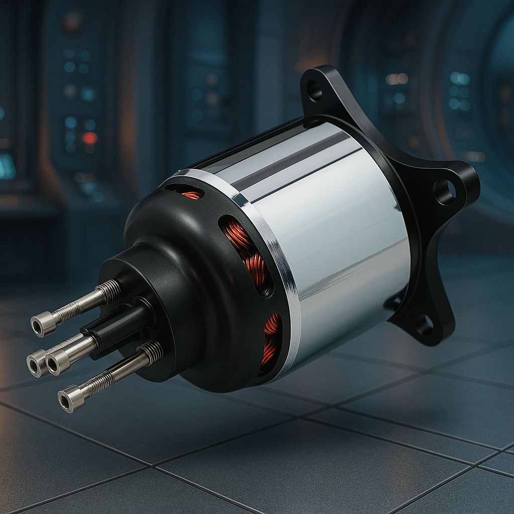

<h1 class="page-title">Antriebe</h1>
<section class="product-detail">
  
  
Leistungsstarke Außenläufer-Motoren für höchste Effizienz und Zuverlässigkeit.

</section>
<section class="text-content">
  <h2>Präzision in Rotation – Torcman Außenläufer für höchste Ansprüche</h2>
  
Unsere Antriebe sind das Herzstück vieler außergewöhnlicher Modelle – und oft der Unterschied zwischen gutem und außergewöhnlichem Flugverhalten. Bei Torcman steht der Außenläuferantrieb im Mittelpunkt: Ein Konzept, das wir seit über 20 Jahren kontinuierlich weiterentwickeln. Im Gegensatz zu Getriebelösungen setzt unser Direktantrieb auf maximale Effizienz, unverfälschte Kraftübertragung und extreme Laufruhe – ohne mechanischen Verschleiß, ohne Kompromisse.

  
Jeder Motor wird in unserer Manufaktur in Deutschland gefertigt. Dabei legen wir höchsten Wert auf Fertigungstoleranzen im Hundertstelmillimeterbereich, präzise gewuchtete Rotoreinheiten und sorgfältig abgestimmte Magnetkonzepte. So entstehen Antriebe, die nicht nur durch Zahlen beeindrucken, sondern durch ihre Performance in der Luft.

  
Unsere Kunden reichen vom engagierten Segelflugpiloten bis hin zum Industriekunden, der einen zuverlässigen Antrieb für eine Spezialanwendung benötigt. Ob Thermikschleicher, Akrobat oder Hochleistungs-Schleppmodell – wir beraten dich individuell und konfigurieren gemeinsam mit dir den idealen Antrieb.

  
Unsere Motoren zeichnen sich aus durch:

  <ul>
    <li>Höchste Wirkungsgrade durch getriebelose Direktantriebe</li>
    <li>Minimalste Laufgeräusche und Vibrationen – für echtes Fluggefühl</li>
    <li>Hohe thermische Belastbarkeit – auch bei langen Steigflügen</li>
    <li>Modulare Bauweise für verschiedenste Anwendungen</li>
    <li>Personalisierte Beratung und Auswahl anhand deiner Flugziele</li>
  </ul>
  
Optional mit:

  <ul>
    <li>Integriertem Getriebefreilauf</li>
    <li>Wasserkühlung für Spezialanwendungen</li>
    <li>Sensorlösungen für Industrie oder Autopilot-Systeme</li>
  </ul>
  
Dein Modell ist einzigartig – dein Antrieb sollte es auch sein.

</section>
