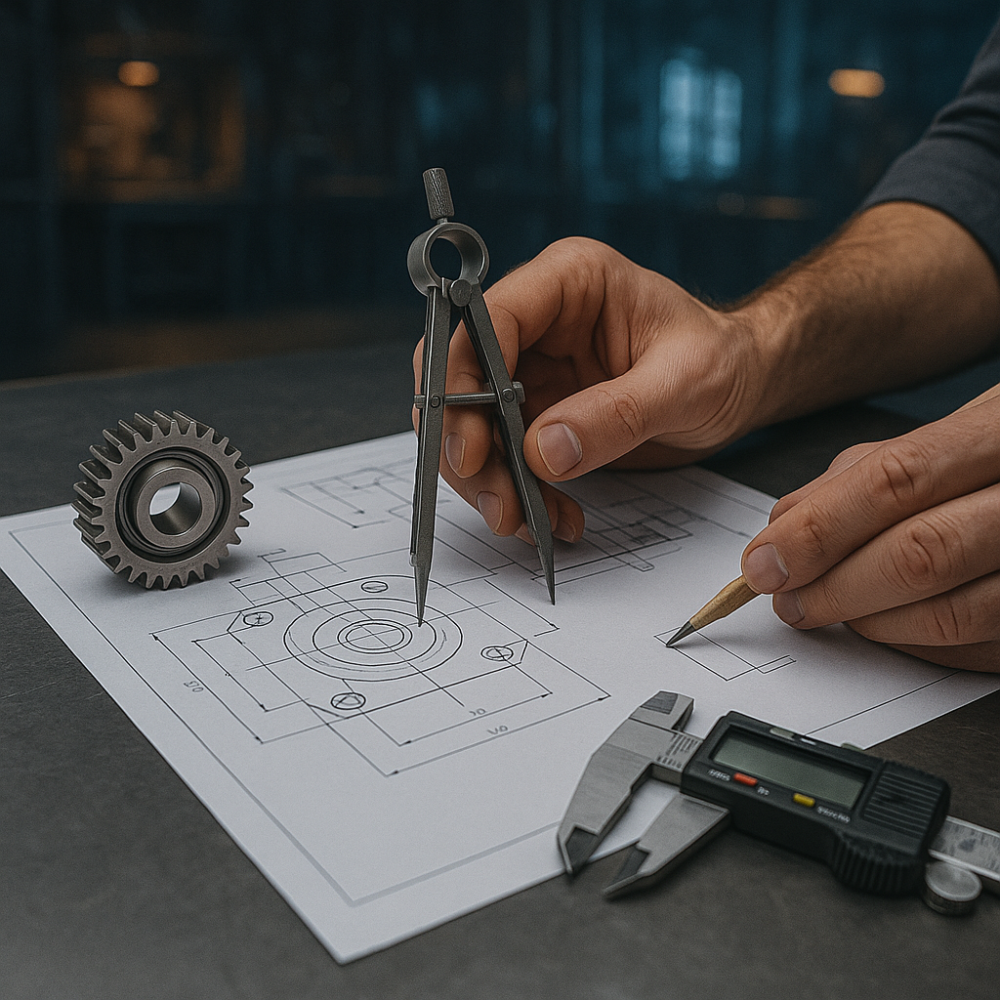

<h1 class="page-title">Entwicklung</h1>
<section class="product-detail">
  
  <h2>Deine Idee. Unsere Lösung. – Entwicklungskompetenz für Modell und Industrie</h2>
  
Ob Maßanfertigung für den Wettbewerbspiloten oder Sonderentwicklung für industrielle Anwendungen: Torcman entwickelt, was nicht von der Stange kommt. Unsere Stärke liegt im Verständnis komplexer Anforderungen – und der Fähigkeit, sie effizient in technische Lösungen zu übersetzen. Von der ersten Machbarkeitsanalyse über CAD-Entwürfe, Simulationen und Prototypen bis hin zur Serienfertigung in kleinen Stückzahlen bieten wir den kompletten Entwicklungszyklus.

  
Dabei profitieren unsere Partner von kurzen Wegen, tiefem Anwendungsverständnis und der einzigartigen Kombination aus Modellflug-Know-how und industrieller Denkweise. Unsere Motoren kommen zum Einsatz in Schleifmaschinen, Drohnen, Generatoren, Forschungseinrichtungen und überall dort, wo maximale Effizienz auf minimalem Bauraum gefragt ist.

  <h3>Unser Angebot für B2B &amp; Individualkunden:</h3>
  <ul>
    <li>Entwicklung von Sonderantrieben (z.&nbsp;B. für Generatorbetrieb, Spezialspindeln, Roboter)</li>
    <li>Antriebsauslegung &amp; Thermiksimulation</li>
    <li>Elektronikentwicklung (z.&nbsp;B. Sensorik, Reglersoftware, EMV-gerechtes Design)</li>
    <li>CNC-Fertigung &amp; Montage im Haus</li>
    <li>Serienbegleitung &amp; Dokumentation</li>
  </ul>
  <h3>Branchen &amp; Anwendungen:</h3>
  <ul>
    <li>Maschinenbau &amp; Automatisierung</li>
    <li>Luftfahrt &amp; UAV-Systeme</li>
    <li>Robotik &amp; Laborautomation</li>
    <li>Energiegewinnung &amp; mobile Versorgungssysteme</li>
  </ul>
  
Du hast ein Projekt – wir liefern die passende Lösung. Schnell, direkt, belastbar.

</section>
