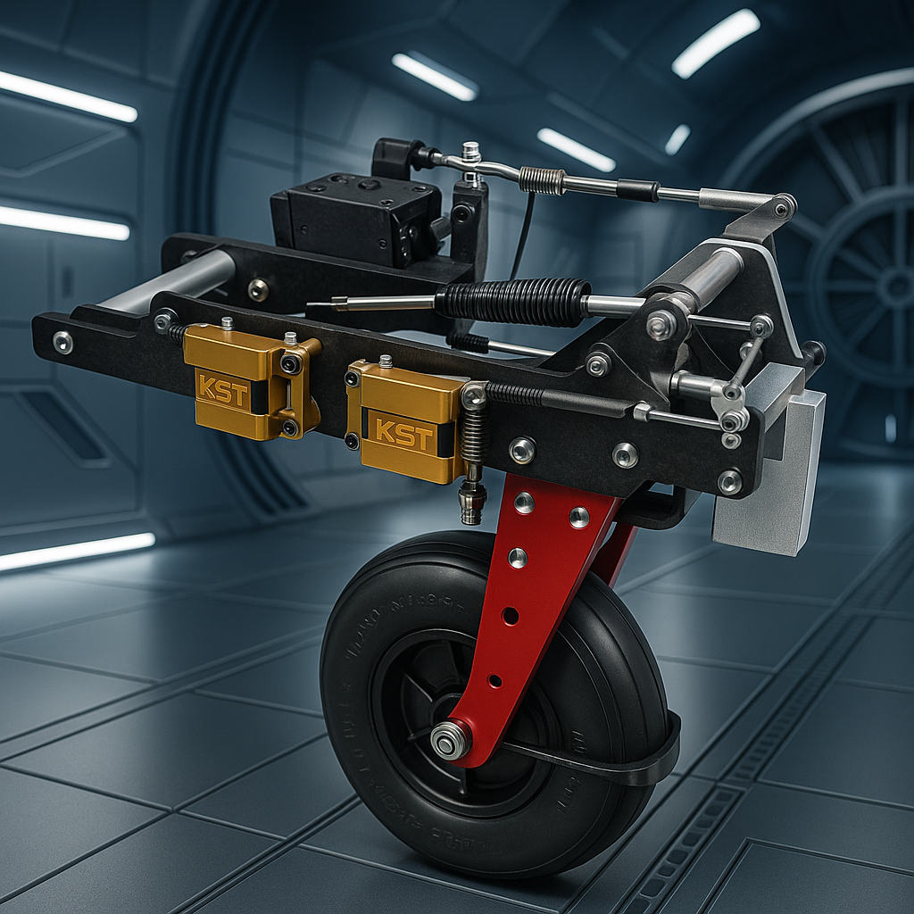

<h1 class="page-title">Fahrwerke</h1>
<section class="product-detail">
  
  <h2>Sicher landen, sauber starten – Elektrische Fahrwerke mit System</h2>
  

    Ein Fahrwerk entscheidet maßgeblich über sauberes Rollen, sichere Starts und weiche Landungen – und beeinflusst wesentlich Optik und Gewicht eines jeden Flugmodells. Bei Torcman setzen wir auf elektrische Einziehfahrwerke, die speziell für Großsegler und anspruchsvolle Scale-Modelle konzipiert sind.
  

  

    Die neue Generation unserer elektrischen Einziehfahrwerke baut auf den bewährten Konstruktionen von <strong>FEMA</strong> auf – einer etablierten Marke im Bereich der Einziehfahrwerke, deren Vermächtnis und Entwicklungsphilosophie wir stolz weiterführen. Der modulare Aufbau erlaubt es, unsere Fahrwerke exakt auf individuelle Anforderungen und Einsatzbedingungen anzupassen. Diese Modularität ermöglicht nicht nur eine hohe Flexibilität, sondern sorgt auch für optimale Leistung in unterschiedlichsten Szenarien.
  

  

    Unsere Fahrwerke zeichnen sich besonders durch ihre beeindruckende Stabilität aus. Sie bewältigen zuverlässig harte Landungen und hohe Belastungen. Leistungsstarke Spindelantriebe und eine präzise angesteuerte Endlagenerkennung sorgen dabei für eine einfache Bedienung und hohe Betriebssicherheit.
  

  

    Darüber hinaus bieten wir optional Systeme mit integrierten Radbremsen, Stoßdämpfern oder individuellen Anpassungen für spezielle Scale-Bauten. Die CNC-gefrästen Aluminium-Komponenten gewährleisten dabei höchste Festigkeit bei minimalem Gewicht.
  

  

    Ein weiterer entscheidender Vorteil ist unser attraktives Preis-Leistungs-Verhältnis. Wir haben uns zum Ziel gesetzt, höchste Qualität zu einem erschwinglichen Preis anzubieten, um allen Modellflugbegeisterten Zugang zu einer zuverlässigen und technisch hochwertigen Lösung zu ermöglichen.
  

  <h3>Technische Highlights</h3>
  <ul>
    <li>CNC-gefräste Komponenten für maximale Robustheit</li>
    <li>Selbsthemmende Spindelantriebe für spielfreie Positionierung</li>
    <li>Intelligente Endlagenabschaltung (optional stromüberwacht)</li>
    <li>Wartungsarme und servicefreundliche Konstruktion</li>
    <li>Skalierbar – von Standardlösungen bis hin zu kundenspezifischen Entwicklungen</li>
  </ul>
  

    Ein Fahrwerk ist nicht nur ein Bauteil – es ist dein Kontakt zur Welt. Mit <strong>FEMA by Torcman</strong> entscheidest du dich für Stabilität, Funktionalität und Modularität, die dein Modellflug-Erlebnis nachhaltig verbessern.
  

</section>

<section class="fahrwerk-helper">
  <h2>Fahrwerksauswahl-Helfer</h2>
  <form id="auswahlForm">
    <label>
      Startgewicht (kg):
      <input type="number" id="startgewicht" step="0.1" min="0" required>
    </label>
    <label>
      Propellerdurchmesser (Zoll):
      <input type="number" id="propeller" step="0.1" min="0" required>
    </label>
    <button type="submit" class="btn">Suchen</button>
  </form>
  

</section>
