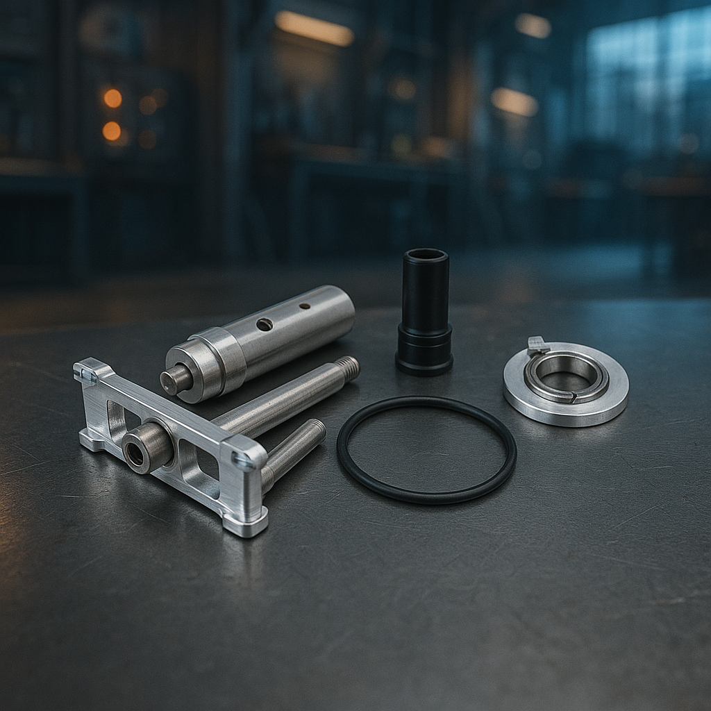
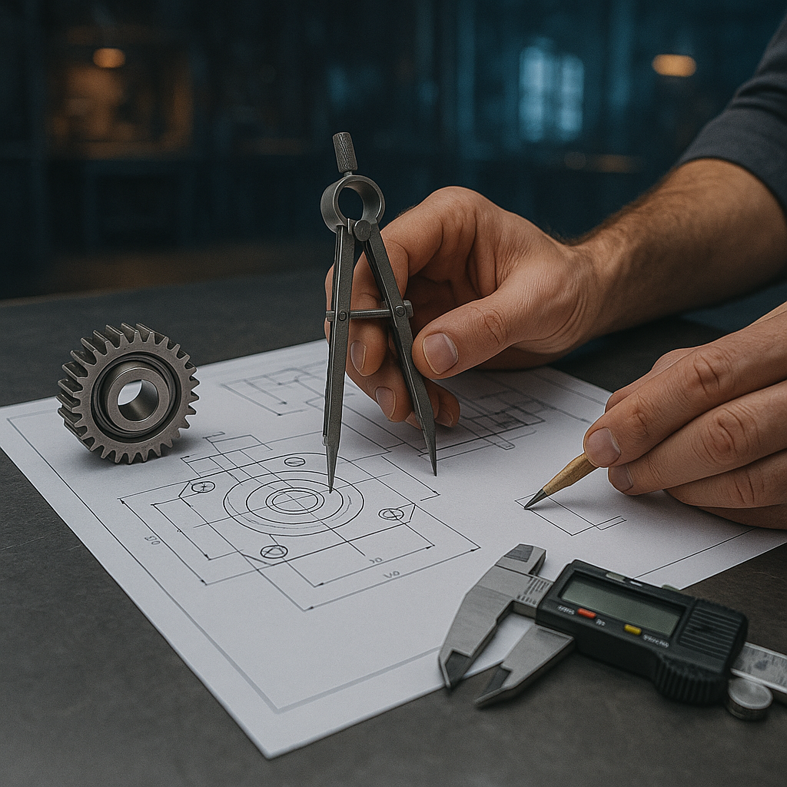

<h1 class="page-title">Produkte</h1>
<section class="product-grid">
  

    
    <h3>Antriebe</h3>
    
Leistungsstarke Außenläufer-Motoren für höchste Effizienz.

    <a href="antriebe.html" class="btn">Mehr erfahren</a>
  

  

    
    <h3>Fahrwerke</h3>
    
Präzise gefertigte Einziehfahrwerke für elegante Starts.

    <a href="fahrwerke.html" class="btn">Mehr erfahren</a>
  

  

    
    <h3>FES-Ex System</h3>
    
Innovative Front-Elektro-Startlösungen für Segelflugmodelle.

    <a href="fes-ex-system.html" class="btn">Mehr erfahren</a>
  

  

    
    <h3>Zubehör</h3>
    
Passgenaues Zubehör – von Luftschrauben bis Spezialkabeln.

    <a href="zubehoer.html" class="btn">Mehr erfahren</a>
  

  

    
    <h3>Entwicklung</h3>
    
Maßgeschneiderte Entwicklungsdienstleistungen für Antriebssysteme.

    <a href="entwicklung.html" class="btn">Mehr erfahren</a>
  

</section>
